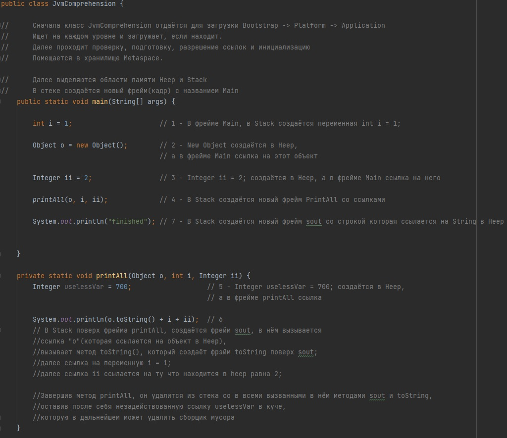

# 4.1 (модуль 3): JVM. Организация памяти, сборщики мусора, VisualVM #
*** 
### Задача -  "Понимание JVM" ###
***
 - ClassLoader'ы;
 - области памяти (стэк (и его фреймы), хип, метаспейс);
 - сборщик мусора;
<<<<<<< HEAD
***

=======
*** 

>>>>>>> 88255be9d0a6347c5827c6f958d1eae53b1e7425
